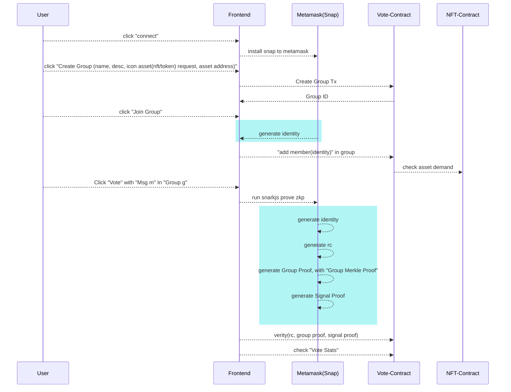

# Workshop

```mermaid
sequenceDiagram
	participant U 	as User
	participant F 	as Frontend
	participant M 	as Metamask(Snap)
	participant VC 	as Vote-Contract
	participant NC 	as NFT-Contract
	
  U -->> F : click "connect"
  F -->> M : install snap to metamask

  U -->> F : click "Create Group (name, desc, icon asset(nft/token) request, asset address)"
  F -->> VC : Create Group Tx
  VC -->> F : Group ID

  U -->> F : click "Join Group"
	rect rgba(0, 220, 220, .3)
    M -->> F : generate identity
  end
  F -->> VC : "add member(identity)" in group
  VC -->> NC : check asset demand

  U -->> F : Click "Vote" with "Msg m" In "Group g"
  F -->> M : run snarkjs prove zkp
	rect rgba(0, 220, 220, .3)
    M -->> M : generate identity
    M -->> M : generate rc
    M -->> M : generate Group Proof, with "Group Merkle Proof"
    M -->> M : generate Signal Proof 
  end
  F -->> VC : verity(rc, group proof, signal proof)
  F -->> VC : check "Vote Stats"

```
