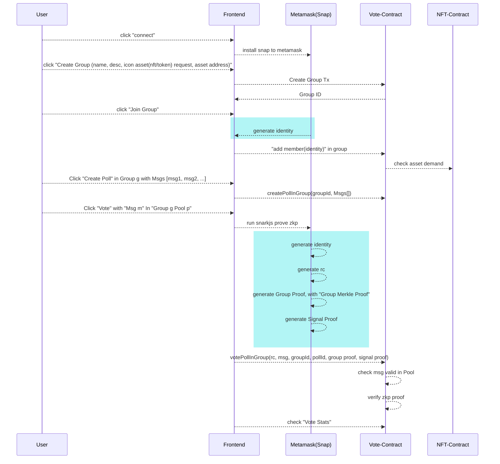

# Workflow



# Setup Snap
```shell
  git clone https://github.com/samzkback/zkvoteLegacy.git
  nvm use
  yarn install
  cd packages/snap/
  yarn build:snap;yarn start
```

# The Graph
https://api.thegraph.com/subgraphs/name/samzkback/zkvotev2  
ID : QmbZYif3cTafHB7AZrtNf9odeb49HVU4aEu1VZUNsbkLo8
